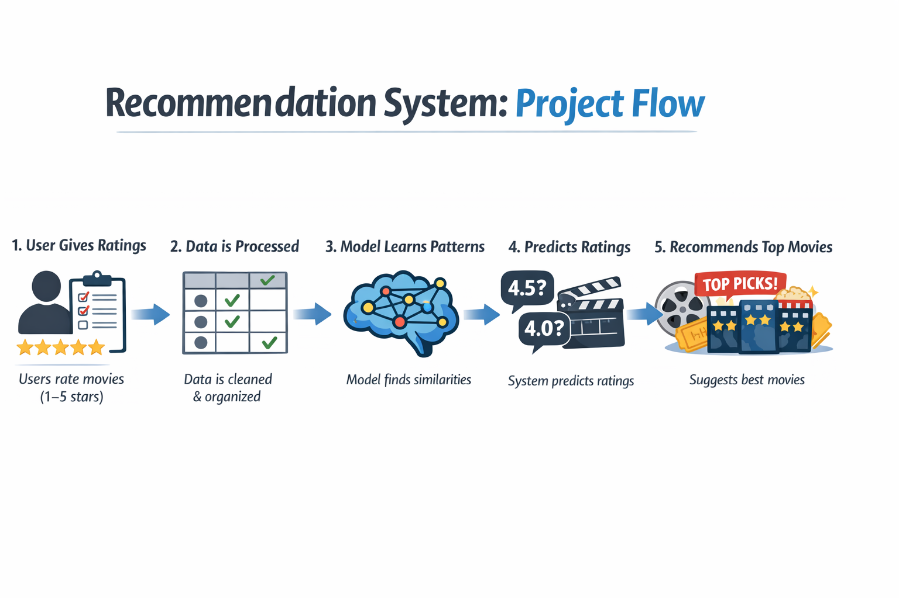

## 🎬 AI-Powered Movie Recommendation System

AI-Powered Movie Recommendation System is an end-to-end movie recommendation system that provides personalized movie suggestions based on user preferences and ratings. The system uses **Collaborative Filtering with Deep Learning (Matrix Factorization)** and an interactive **Streamlit** frontend to deliver real-time recommendations.

This project demonstrates practical application of machine learning, deep learning, and full-stack integration using Python.

---
## Project Highlights
- End-to-end ML system from data preprocessing to deployment
- Cold-start handling for new users
- Modular and scalable codebase
- Interactive UI for real-time recommendations
- Industry-relevant dataset (MovieLens)
---
##  Features
- Personalized movie recommendations
- Collaborative filtering using Matrix Factorization
- Deep learning model built with PyTorch
- Cold-start handling for new users
- Interactive Streamlit web interface
- Real-time recommendations
- Clean and modular project structure

---

##  Recommendation Method

The recommendation engine is based on **Collaborative Filtering**:

- Users and movies are represented as low-dimensional embedding vectors
- The model learns latent features from user–movie rating interactions
- Predictions are generated using dot-product of user and movie embeddings
- New users are handled by initializing embeddings using the mean of existing users and dynamically updating based on ratings

---

##  System Architecture

User rates movies in Streamlit UI  
→ Ratings sent to recommendation logic  
→ PyTorch model predicts unseen movie ratings  
→ Top-N recommended movies displayed to user  

<p align="center">
  
</p>

---
<h2>🔄 Project Workflow</h2>

<p align="center">
  
</p>

## 📊 Dataset

**MovieLens Dataset**
 
 Source: https://grouplens.org/datasets/movielens/

Files used:
- `ratings.csv`  
  Contains userId, movieId, rating
- `movies.csv`  
  Contains movieId and title

Why MovieLens:
- Real-world dataset
- Widely used for recommendation systems
- Clean and well-structured

---

##  Tech Stack

**Frontend**
- Streamlit

**Backend / ML**
- Python
- PyTorch
- Pandas
- NumPy

**Dataset**
- MovieLens

---
## 📁 File Structure
```

AI-Powered-Recommendation-Engine/
│
├── app.py                     # Streamlit application
├── model.pth                  # Trained PyTorch model
├── requirements.txt
├── README.md
│
├── data/
│   ├── movies.csv
│   └── ratings.csv
│
├── ml-latest-small/            # Original MovieLens dataset
│
├── notebooks/
│   ├── Data Preprocessing.ipynb
│   ├── Collaborative Filtering.ipynb
│   ├── PyTorch model.ipynb
│   └── Testing.ipynb
│
├── src/
│   ├── __init__.py
│   ├── data.py                 # Data loading & preprocessing
│   ├── model.py                # Matrix Factorization model
│   ├── recommend.py            # Recommendation logic
│   └── train.py                # Model training script
│
├── test_data_loading.py
├── test_env.py
└── venv/
```
---
##  Model Info (model.pth)

The file `model.pth` contains the **pre-trained Matrix Factorization model**
implemented using **PyTorch**.

- Trained on the MovieLens dataset
- Learns latent features for users and movies
- Used directly by the Streamlit app for recommendations
- No retraining is required to run the application

This allows users to get instant recommendations without training the model again.

---
## ▶️ How to Run

1️⃣ Clone the repository
```
git clone <repository-url>
cd AI-Powered-Recommendation-Engine
```
2️⃣ Create and activate a virtual environment
```
python -m venv venv

# Windows
venv\Scripts\activate

# Linux / macOS
source venv/bin/activate


```
3️⃣ Install required dependencies
```
pip install -r requirements.txt
```
4️⃣ Run the Streamlit application
```
streamlit run app.py
```
5️⃣ Open your browser

- The app will run at: `http://localhost:8501`
- Select movies from the list
- Give ratings (1–5)
- Get personalized movie recommendations

---
## Limitations
- Recommendations depend only on ratings (no content features)
- Cold-start users need at least a few ratings
- No user authentication or persistent profiles
- Model accuracy not yet quantitatively evaluated
---
## 📈 Future Improvements

- Add movie posters and metadata using TMDB API
- Combine collaborative and content-based filtering
- Improve model accuracy using deep learning techniques
- Add user login and persistent profiles
- Deploy the application on cloud platforms
- Include evaluation metrics like RMSE and Precision@K

---
